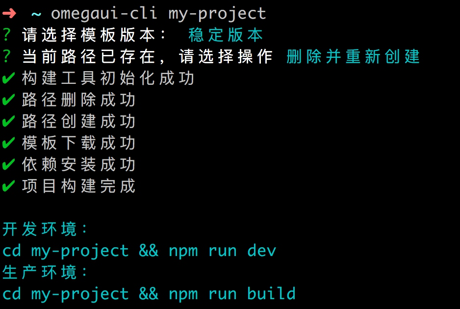

该项目已迁移至  [Shine Design](https://github.com/shine-design/shine-design)，本项目停止更新。

<hr />

# OmegaUI Command Line Interface
>OmegaUI 快速构建工具

### 依赖
> node >= 9.0.0 && npm >= 6.0.0

### 安装
```bash
$ npm install omegaui-cli
```

### 使用
```bash
$ omegaui-cli init my-project
```
>可以使用简写 i 替代 init 。

### 开发环境
```bash
cd my-project && npm run dev
```

### 生产环境
```bash
cd my-project && npm run build
```

### 相关说明
- 稳定版本：功能均经过完整测试，状态稳定，推荐使用。
- 开发版本：存在未经完整测试功能。

### 截图

